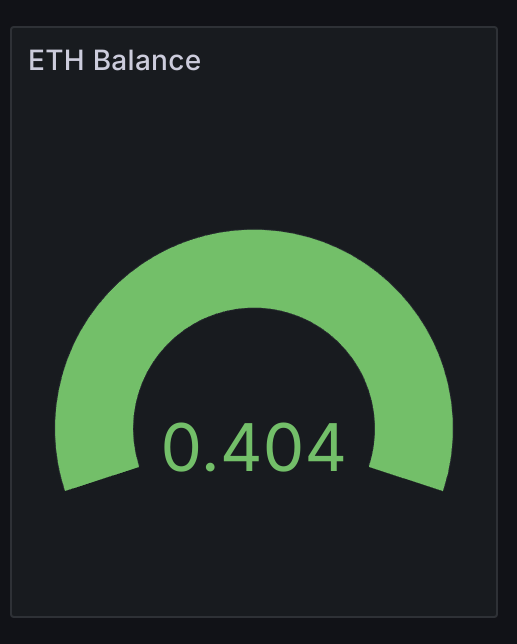
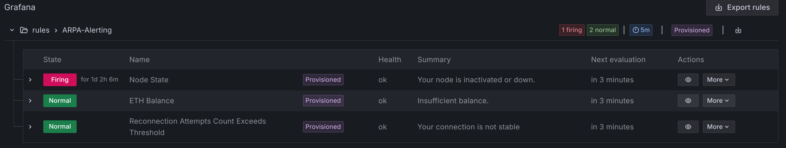
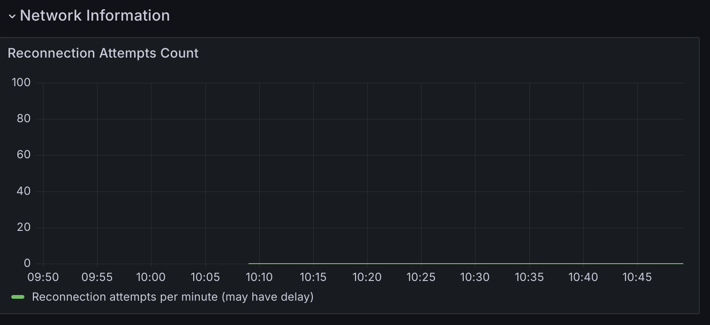
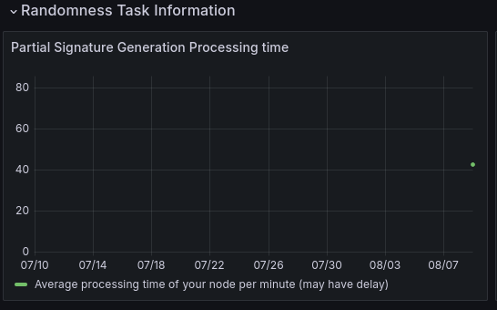
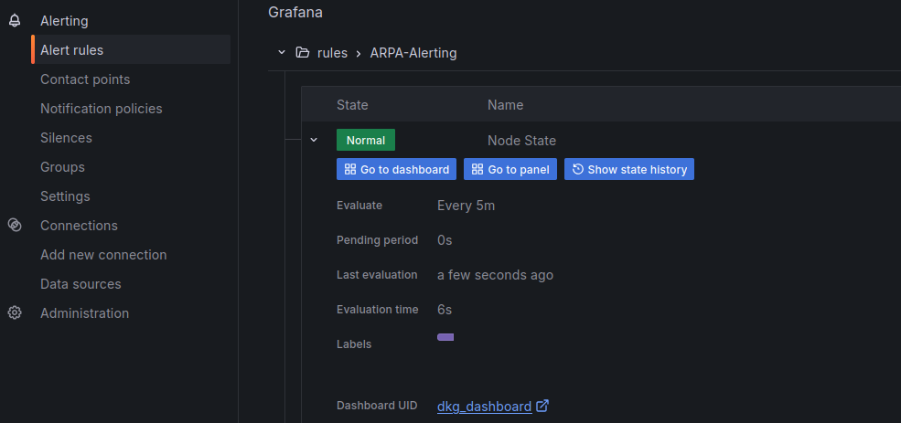

## Eigenlayer Operator Reward Policy

Our Eigenlayer operator rewards are distributed every **30 days**.

To get rewards, you will need to fulfill the following requirements during each period (for more details, please reach out to our Telegram group):

1. Keep a minimum of **100 staked ETH** in your **Operator account**
2. Keep **Node account** balance above **0.2 ETH on L1**, and **0.05 ETH on each supported L2s**(Currently OP & Base & Redstone)
3. **No deactivation incident** due to not responding correctly to the DKG grouping process in time
4. **At least 1 partial signature** to a randomness fulfillment

## Inspection

1. Please go to Eigenlayer dashboard to check your balance and status. You can find the dashboard at [https://app.eigenlayer.xyz/operator](https://app.eigenlayer.xyz/operator).

2. There is a panel and an alert for insufficient balance of **Node account** on L1. You can check "ETH Balance" panel in the dashboard, and the alert history by going to alerting/alert rules, expanding the rule you want to see then clicking `Show state history`. For L2s, the panels and alarms will be added in the next version, but the balance on L2 will not be consumed quickly. Please fund your Node account with the corresponding amount.

   

   

3. Unstable WSS connections are often the cause of deactivation when ETH balance is sufficient. There is a panel and an alert for unstable connections. You can check "Reconnection Attempts Count" panel in the dashboard, and the alert history by going to alerting/alert rules, expanding the rule you want to see then clicking `Show state history`.
   

   

4. There is a panel for the number of partial signatures. You can check "Partial Signature Generation Processing time" panel in the dashboard. At present, having data points within 30 days indicates successful participation in the randomness task.

   

## Additional Tips and Warnings

1. We have provided alerts in our monitoring tool to take action before deactivation occurs.

   - to use the alert, please follow [setup instructions step #5](setup-instructions.md#step-5-optional-set-up-alert-rules). We strongly recommend you to set up the contact point for the alert, so you can receive notifications when the alert is triggered.
   - to check history state of alert, you can go to alerting/alert rules, expand the rule you want to see then click `Show state history`, like 

2. To see if you meet requirements within the last 30 days, change the time range of dashboard in Grafana to "Last 30 days" (you can find this setting in the top right section of the dashboard page).
3. To ensure no metric data is missed, we highly suggest you keep this monitoring tool always on and do not remove your Docker container instance.
