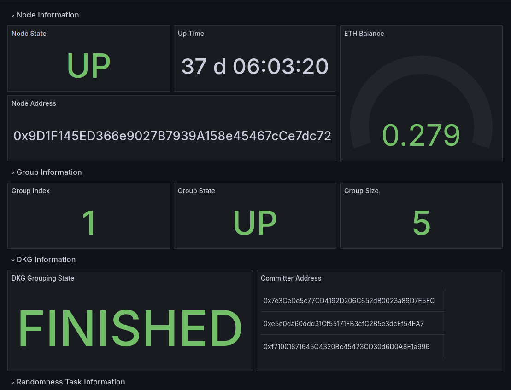

## Setup Instructions

Please check our prerequisites [here](https://github.com/ARPA-Network/BLS-TSS-Network/blob/main/docs/eigenlayer-onboarding.md#prerequisites).

### Step 1: Clone the repo

```bash
git clone https://github.com/ARPA-Network/ARPA-Network-AVS-Monitoring.git
```

### Step 2: Update configuration

Update `config.yml` file in the root directory.

### Step 3: Run setup script

```bash
chmod +x setup.sh
./setup.sh
```

This will create the following two files which are used by the custom-exporter and cloudwatch-exporter containers:
- aws_exporter_config_example.yml
- custom-exporter/exporter-config.yml

You can always change your node config at a later time by doing the following
- Update config.yml with new node info.
- Re-run the setup script.
- Restart your docker container with docker compose.

### Step 3.5 [Temporary step - to be deleted later]:

1. Rename `docker-compose-example.yml` to `docker-compose.yml` and update AWS secret manually.
2. Manually build the custom exporter image:

```bash
cd custom-exporter
docker build -t custom-exporter:latest .
cd ..
```

### Step 4: Start the tool

Ensure Docker is running and execute:

```bash
docker compose up -d
```

### Step 5: Access Grafana

Go to loacalhost:3000 
Default login credentials are "admin:admin". These should be changed the first time you log in.
Wait for 30 seconds. You should be able to see data in Grafana (http://localhost:3000/d/dkg_dashboard/arpa-network-dashboard?orgId=1&refresh=30s). 

Example should look like 

### Step 6 (Optional): Set up alert rules

1. Go to Alerting in Grafana.
2. Add your contact in the default location under Contacts.
3. You may also add custom alerting rules by following instructions from [Grafana documentation](https://grafana.com/docs/grafana/latest/alerting/).


### Advanced Configurations

For users who are interested in advanced configuration , please see [here](./advanced-config-operations.md)